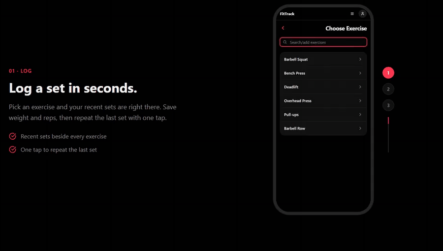
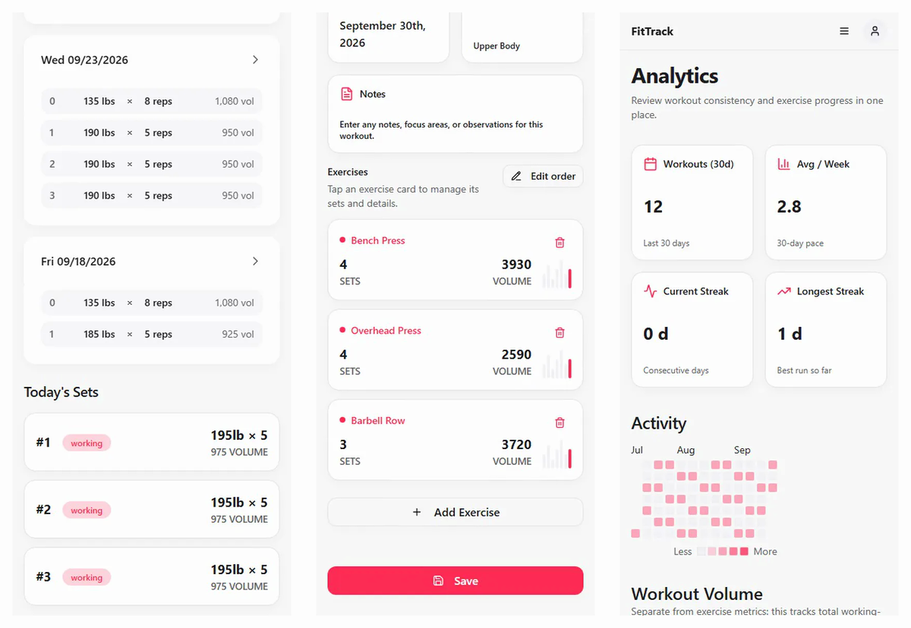

# FitTrack

A full-stack fitness tracking application with a Go backend and React frontend.

<p align="center">
  
</p>

<picture>
  <source media="(prefers-color-scheme: dark)" srcset="docs/media/app-screens-dark.png">
  
</picture>

These are real captures of guest demo mode. Regenerate them with `bun run media:capture` (see [Landing and README Media](docs/development.md#landing-and-readme-media)).

## Architecture

- **Backend**: Go API with PostgreSQL database
- **Frontend**: React with TypeScript, TanStack Router, and TailwindCSS
- **Auth**: Stack authentication with JWT verification
- **API**: OpenAPI/Swagger specification with auto-generated client code
- **AI chat**: In-process Go API slice under `/api/ai/*` with Postgres-owned conversation state and fetch-based SSE

## Quick Start

For a full local setup, start with the development guide:

- [Development Guide](docs/development.md)
- [Backend Setup](server/README.md)
- [Frontend Setup](client/README.md)

Short version:

```bash
cd server
cp setenv.example.sh setenv.sh
cp .env.example .env
make dev
```

```bash
cd client
cp .env.example .env
bun install
bun run dev
```

## Everyday Workflow

- Update backend API structs and annotations.
- Run `cd server && make swagger`.
- Run `cd client && bun run openapi-ts`.
- Commit the generated `server/docs/` and `client/src/client/` changes with the API change.

See [API Type Workflow](docs/development.md#api-type-workflow) for the full type-safety workflow.

## Documentation

- [Development Guide](docs/development.md) - setup, commands, generated API types, and local E2E chat flow
- [Environment Reference](docs/environment.md) - local, test, preview, and production variables
- [Production Triage](docs/production-triage.md) - deploy, health, logs, and user billing checks
- [Stripe Billing](docs/stripe-billing.md) - checkout, webhook, subscription access, and trial prompt behavior
- [Backend Setup](server/README.md) - detailed backend development guide
- [Frontend Setup](client/README.md) - React/TanStack development guide
- [AI Chat Observability](docs/ai-chat-observability.md) - observability notes for the AI chat slice
- [AI Chat Health Triage](docs/ai-chat-health-triage.md) - read-only health triage for the AI chat slice

## Project Structure

```text
.
+-- server/           # Go backend
|   +-- cmd/api/      # API entry point
|   +-- docs/         # Generated OpenAPI docs
|   +-- internal/     # Internal packages
|   +-- migrations/   # Database migrations
+-- client/           # React frontend
|   +-- src/
|   |   +-- client/   # Generated API client
|   +-- package.json
+-- docs/             # Cross-project guides and notes
```

## Contributing

1. Create a feature branch.
2. Make the narrowest change that fully solves the issue.
3. Follow the [API Type Workflow](docs/development.md#api-type-workflow) when API contracts change.
4. Run the relevant checks before opening a pull request.
