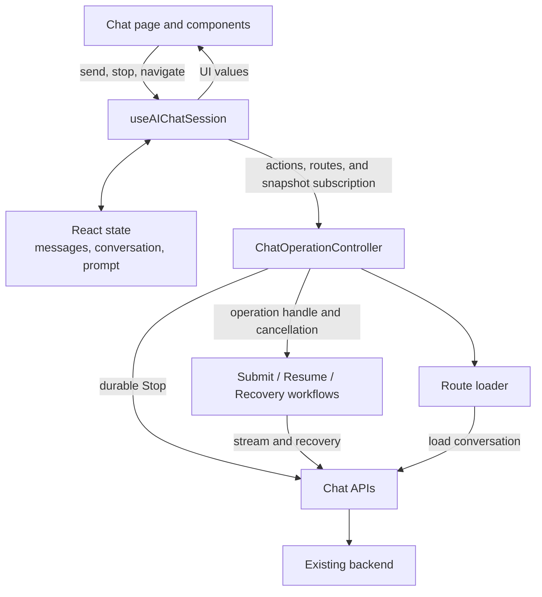
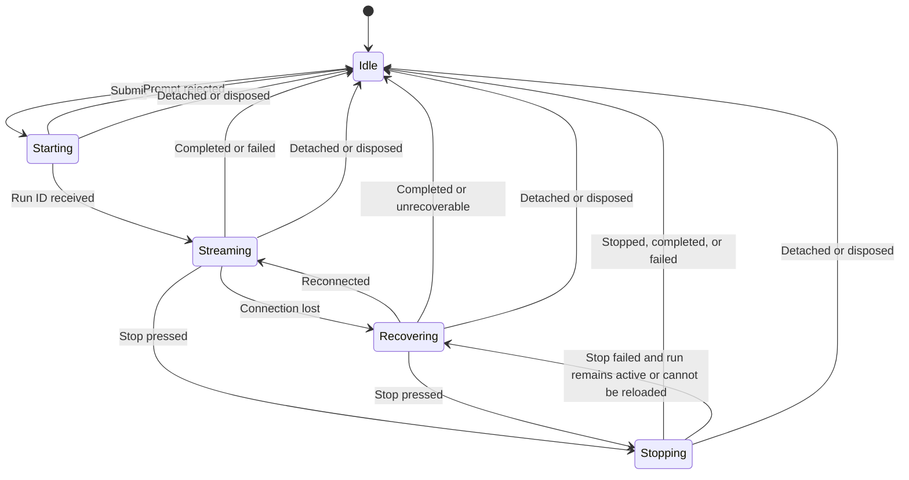

# Client Chat Operation Controller Architecture

**Status:** Agreed implementation design  
**Scope:** FitTrack AI chat client  
**Backend changes:** None

## Goal

Replace distributed chat lifecycle state with one feature-local controller while preserving the hook's public API and existing navigation, recovery, and background-generation behavior.

Delivery is split into two sequential PRs. The first is a behavior-preserving controller migration. The second makes the intentional user-facing change: pressing Stop immediately stops visible streaming while the durable Stop request runs independently against the existing backend.

## Boundaries

### Chat page and components

The page and its components are responsible only for presentation and user actions:

- Display messages and conversation state.
- Edit the prompt.
- Show Send or Stop controls.
- Call the chat hook.

They do not coordinate cancellation, recovery, operation ownership, or route handoffs.

### `useAIChatSession`

The hook remains the React-facing boundary and keeps its existing public API.

It owns:

- Conversation and message React state.
- Prompt text.
- Passing route changes and user actions to the controller.
- Applying controller and workflow results to the UI.
- Reading the controller's cached snapshot through `useSyncExternalStore`.

The hook derives `isSubmitting`, `activeRunId`, and `canStop` from the controller snapshot instead of synchronizing separate React state values. It does not call submit, resume, or recovery workflows directly.

### `ChatOperationController`

A feature-local `ChatOperationController` class replaces `createAIChatSessionLifecycle` as the single client lifecycle boundary. The old lifecycle factory is removed rather than retained beside the controller.

It controls:

- The current operation phase.
- Stable operation identity.
- Current conversation, run, and assistant-message IDs.
- Foreground request cancellation.
- A separate route-load cancellation scope.
- Rejection of callbacks from replaced operations.
- Adoption of a newly created conversation route.
- Invocation and coordination of submit, resume, recovery, route-load, and Stop workflows.
- Immutable, cached snapshots for React.

The controller does not own messages, conversation content, or prompt text. It receives narrow UI-state ports from the hook for workflow updates.

The class should remain feature-specific. It should not introduce inheritance, a generic controller framework, or interface-per-class ceremony.

### Submit, resume, and recovery workflows

The existing feature workflows remain implementation details behind the controller and continue to own application-specific work:

- Calling stream and recovery APIs.
- Processing stream events.
- Updating messages through injected UI-state ports.
- Saving resume cursors.
- Reporting telemetry and errors.

They use a stable operation handle and controller-owned cancellation rather than directly manipulating shared refs, abort controllers, and lifecycle state. The migration removes `activeOperationRef`, `pendingAssistantIdRef`, stream/resume/recovery abort refs, `stopTargetRef`, route-handoff refs, and separately synchronized submitting/run state.

### Route loading

Route loading has a cancellation scope separate from the foreground chat operation.

- When a new conversation is created, the current operation adopts its conversation ID before navigation.
- The resulting expected URL change does not reload or interrupt the operation.
- Navigating to another route cancels the browser's local operation.
- Navigation does not call the Stop API; backend generation continues.
- Returning to the conversation loads or resumes its server state.

### Backend

The backend remains unchanged. It continues to own:

- Durable generation.
- Authorization.
- Run locking.
- Transactional message and run updates.
- Cross-process cancellation.
- Idempotent durable Stop behavior.

Server run-status consolidation remains a separate future migration. An explicit Retry recovery UI is also out of scope for these PRs; Stop retry, navigation, and page reload remain available escape paths. Retry recovery can be considered later if telemetry shows meaningful user impact.

## Architecture diagram



## Operation model

The controller exposes an immutable snapshot with these phases:

- `idle`: no foreground operation.
- `starting`: a prompt was submitted, but no run ID has been received.
- `streaming`: the run ID is known and stream events are arriving.
- `recovering`: the run remains active while the client reconnects or checks server state.
- `stopping`: Stop was pressed and durable confirmation is pending.

The active operation owns:

- `conversationId`
- `runId`
- `assistantMessageId`
- phase
- foreground cancellation controller

The stable operation object itself is the ownership identity; no additional symbol token is needed.

Each individual foreground request also has a stable attempt object containing its kind and `AbortController`. Operation identity answers “does this callback belong to the current chat operation?” Attempt identity answers “does this cleanup belong to the current stream, resume, or recovery request?” Starting a replacement attempt updates `operation.currentAttempt`; callbacks and cleanup must validate both identities.



## Derived UI state

The hook derives UI values from the controller snapshot:

| UI value | Derivation |
|---|---|
| `isSubmitting` | Phase is not `idle` |
| `activeRunId` | Current operation's run ID, otherwise `null` |
| `canStop` | Run ID is known and phase is `streaming` or `recovering` |

During `stopping`, the composer remains busy and Stop is disabled to prevent duplicate requests.

A second prompt is ignored while an operation is `starting`, `streaming`, `recovering`, or `stopping`.

## Starting behavior

A run ID is created by the backend while preparing the message stream, before model generation starts. The client receives it in the stream's start event.

1. The user submits a prompt.
2. The operation enters `starting`.
3. For a new chat, create the conversation, adopt its ID, await navigation and chat-history refresh, and then recheck operation ownership.
4. Display optimistic user and assistant messages.
5. Start the stream request; the backend creates the durable messages and run.
6. The start event provides the run and assistant-message IDs.
7. The operation enters `streaming`, and Stop becomes available.

Awaiting new-conversation navigation is existing behavior and remains required. If navigation fails or ownership changes while it is pending, do not start the stream.

If the request fails before a run is known, the client first determines whether the server accepted it:

- If the server rejected it, remove the optimistic messages and restore the prompt.
- If the server may have accepted it, recover server state before deciding whether to restore the prompt.

## Stop behavior

### Immediate presentation

Stop provides immediate local feedback and durable server cancellation:

1. Transition the operation to `stopping`, synchronously starting the independent Stop request.
2. Immediately cancel the local stream or recovery request.
3. Optimistically mark the current partial assistant message as locally stopped so the typing indicator disappears. This is React presentation state only; it does not claim the server has committed Stop.
4. Keep the composer busy and disable Stop while the request is pending.

### Successful API responses

A successful Stop request can report `stopped`, `completed`, or `failed`:

- `stopped`: apply the returned authoritative text and stopped status, clear the resume cursor, and release the operation.
- `completed` or `failed`: Stop lost a terminal-state race. Reload the conversation so messages, errors, and workout-draft state reflect the actual result, then release the operation. If that reload fails, fall back to the response's terminal status and text, surface the load error, and still release the operation because the run is terminal.

The UI must never label a completed or failed run as stopped.

### Failed Stop request

If the Stop request itself fails:

1. Show the Stop error.
2. Reload the same conversation using the separate route-load scope.
3. Reconcile every possible result:
   - **Same active run:** retain the same operation handle, transition it to `recovering`, restore streaming presentation, begin a new recovery attempt, and re-enable Stop.
   - **Different active run:** retire the target operation, create an operation for the returned run, and resume/recover it. This can happen when the target became terminal and another browser or tab started a new run.
   - **No active run but a streaming message remains:** invoke the existing orphaned-message recovery workflow, keep the screen busy, and apply the active or terminal result it discovers.
   - **Terminal state:** apply the actual stopped, completed, or failed state and release the operation.
   - **Reload failure:** retain the original run ID and operation in `recovering`, restore streaming presentation, keep new submission disabled, and re-enable Stop so the user can retry.

A same-run recovery keeps the existing operation identity but always creates a new foreground attempt identity.

If any post-reload resume or recovery attempt fails or times out, do not return to `idle` without authoritative terminal evidence. Retain the applicable operation and known run ID in `recovering`, surface the recovery error, keep submission disabled, and keep Stop retryable. This applies to same-run recovery, different-run recovery, and orphaned-message recovery. The request itself is bounded; only the unresolved controller state remains until recovery, Stop, authoritative reload, navigation, or unmount resolves it.

The Stop request is not canceled by foreground cancellation, route loading, route detachment, or controller disposal. If the user navigates away while it is pending, the request continues but its eventual result cannot update the old screen.

Local stream cancellation alone does not reliably save model tokens. The durable Stop API is what cancels backend generation; starting it immediately minimizes additional generation after the click.

## Ownership and cleanup rules

Every workflow callback and `finally` block carries both its stable operation handle and its foreground attempt handle. Controller transitions such as `finishAttempt(operation, attempt)` only act when:

- the operation still owns the current chat activity;
- the attempt is still `operation.currentAttempt`; and
- the current phase permits the transition.

In particular:

- An aborted submit/resume/recovery `finally` cannot release an operation in `stopping`; the Stop outcome owns that transition.
- If Stop failure starts recovery attempt B, late cleanup from canceled stream attempt A is ignored even though both attempts belong to the same operation.
- Callbacks from detached, replaced, or inactive attachments are ignored.
- Completing an old operation cannot clear a newer route's operation.
- Route detachment and mounted-controller attachment cleanup are distinct.

Terminology is explicit throughout the implementation:

- **Abort:** end a browser request through its `AbortController`; this does not durably stop generation.
- **Detach:** stop displaying an operation because the selected route changed; backend generation continues.
- **Stop:** invoke the durable server Stop API.

## Navigation behavior

### New-conversation handoff

Today, mutable route-handoff flags and effect ordering prevent a newly created conversation URL from interrupting its stream. The controller replaces this with explicit adoption:

```ts
operation.adoptConversation(createdConversation.id);
navigateToConversation(createdConversation.id);
```

When the URL changes to the operation's adopted conversation, the hook does not reload it.

### Other navigation

Changing the selected conversation or starting a new chat keeps the mounted controller but detaches its current operation:

- Cancel local foreground requests.
- Invalidate the detached operation's UI callbacks.
- Do not call Stop.
- Allow backend generation to continue.
- Load or adopt the new route using the same controller.

Leaving the Chat route unmounts the screen and disposes the controller and subscription. It cancels local stream/resume/recovery/route-load work and ignores later UI results. An already-started Stop request remains independent. Hard refresh, tab close, browser close, or network loss cannot guarantee that a pending request reaches the backend.

Returning later creates a new controller and loads or resumes the conversation from durable server state.

## React subscription and attachment lifecycle

The controller exposes:

- A cached immutable snapshot.
- A `subscribe()` method.
- An attachment lifecycle that is safe under React Strict Mode.

The hook consumes snapshots through `useSyncExternalStore`. The snapshot must retain the same object identity until lifecycle state actually changes. Streamed message content stays in React state, so controller subscriptions do not introduce additional token-by-token rerenders.

React Strict Mode can run effect setup, cleanup, and setup again against the same controller instance. The controller therefore must not become permanently unusable after the first cleanup. Each setup creates a stable attachment object/generation, and every operation and attempt belongs to that attachment. Cleanup detaches only the matching attachment, aborts its local work, and invalidates its callbacks. A later setup creates a new attachment; callbacks and Stop results from an older attachment cannot update it.

A real unmount performs the same attachment cleanup. The component is gone because React does not run another setup, while an independent Stop request may still complete without publishing UI state.

## Delivery plan

### PR 1: complete behavior-preserving controller migration

- Add the feature-local controller and direct transition tests.
- Replace `createAIChatSessionLifecycle` completely.
- Migrate submit, resume, recovery, route loading, and existing Stop coordination to stable operation handles.
- Remove duplicated refs, abort controllers, route-handoff flags, and synchronized lifecycle state.
- Replace route timing flags with explicit conversation adoption while preserving awaited navigation.
- Preserve current visible Stop timing: do not yet cancel or mark the message stopped before the API response.
- Keep the hook's public API and all existing regression behavior intact.

PR 1 must not leave controller state and legacy refs as simultaneous authorities.

### PR 2: optimistic Stop behavior

- Add the `stopping` presentation and immediate local cancellation.
- Optimistically remove the typing presentation.
- Handle `stopped`, `completed`, and `failed` responses explicitly.
- Add Stop-failure reload, same-operation recovery, retry, and reload-failure behavior.
- Add focused UI and race tests for Stop, navigation, disposal, late callbacks, and retry.

PR 2 starts only after PR 1 is merged or rebased cleanly and its baseline remains green.

## Testing strategy

### Controller tests

Test lifecycle behavior directly through the public controller and operation-handle API:

- Starting and receiving a run ID.
- Stable operation and foreground-attempt identity.
- Ignoring late cleanup from a replaced attempt within the same operation.
- Ignoring callbacks from replaced operations and older attachments.
- Route adoption.
- Navigation cancellation.
- Streaming and recovery transitions.
- Late workflow cleanup while Stop is pending.
- Optimistic Stop and each durable result: stopped, completed, and failed.
- Stop failure reconciliation for the same active run, a different active run, an orphaned streaming message, a terminal run, and failed reload.
- Same-run recovery failure and orphaned-message recovery timeout remain unresolved and stoppable rather than incorrectly becoming idle.
- Route detachment versus attachment cleanup while Stop remains pending.
- Snapshot stability and subscriptions.
- Strict Mode setup → cleanup → setup replay.

### Hook integration tests

Retain focused integration coverage for:

- React state updates.
- Optimistic messages and prompt restoration.
- Awaited new-conversation URL handoff and navigation failure.
- Conversation changes versus leaving the Chat route.
- Streaming and recovery events.
- Immediate Stop presentation and every server result.
- Stop retry after Stop and reload both fail.

The existing hook API remains unchanged, so pages and components should not require refactoring.

## Agreed constraints

- Client implementation only; no backend changes.
- One feature-local class, not a generic framework.
- Operation object identity; no parallel symbol token.
- Route loading remains separately cancellable.
- Messages and prompt remain in React state.
- Existing background-generation behavior on navigation is preserved.
- Stop is available only after a run ID is known.
- Recovery remains visually equivalent to streaming and remains stoppable.
- All current race-regression coverage remains green.
